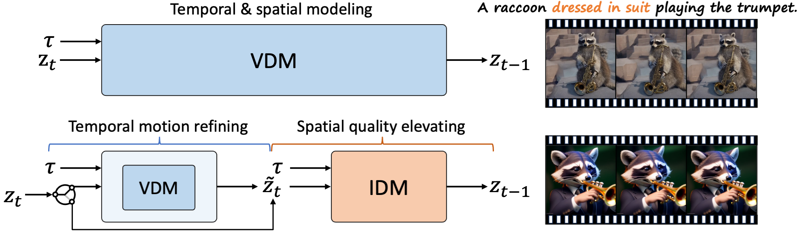

# VideoElevator

**VideoElevator** aims to elevate the quality of generated videos with text-to-image diffusion models. It is *training-free* and *plug-and-play* to support cooperation of various text-to-video and text-to-image diffusion models.

 

**Top:** Taking text τ as input, conventional VDM performs both temporal and spatial modeling and accumulates low-quality contents throughout sampling chain.

**Bottom:** VideoElevator explicitly decompose each step into temporal motion refining and spatial quality elevating, where the former encapsulates VDM to enhance temporal consistency and the latter harnesses IDM to provide more faithful details, e.g., dressed in suit. Empirically, applying VDM in several timesteps is enough to ensure temporal consistency.

## The paper and code will be released soon.
