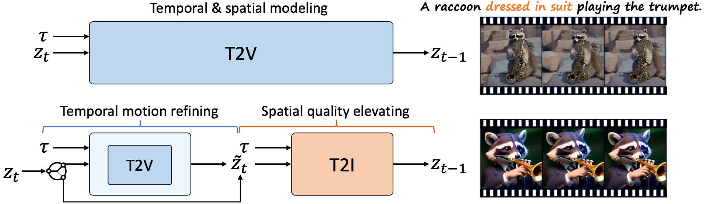

# VideoElevator

https://github.com/YBYBZhang/VideoElevator/assets/40799060/f850bc9c-ccf6-48b3-8011-394986aade71

**VideoElevator** aims to elevate the quality of generated videos with text-to-image diffusion models. It is *training-free* and *plug-and-play* to support cooperation of various text-to-video and text-to-image diffusion models.

## Method

 

**Top:** Taking text τ as input, conventional T2V performs both temporal and spatial modeling and accumulates low-quality contents throughout sampling chain.

**Bottom:** VideoElevator explicitly decompose each step into temporal motion refining and spatial quality elevating, where the former encapsulates T2V to enhance temporal consistency and the latter harnesses T2I to provide more faithful details, e.g., dressed in suit. Empirically, applying T2V in several timesteps is enough to ensure temporal consistency.

## The code will be released in this month.
